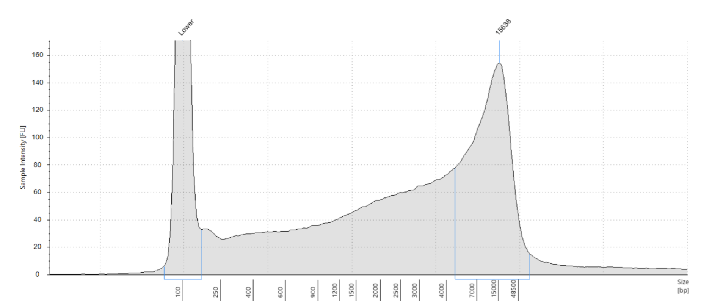

```{r global_options, include=FALSE}
# this tells r to fix images on positions were I want them and don't let LaTeX shuffle them around like crazy
knitr::opts_chunk$set(fig.pos = "H", out.extra = "", fig.align="center")
library("tidyverse")
```

# Introduction

Neodermata are obligate parasitic flatworms, subsuming three groups of plathelminthes including the Trematoda (flukes), Cestoda (tapeworms) and the Monogenea [@littlewood1999; @park2007; @gibson2014]. Most Trematodes and Cestodes are endoparasitic with a complex life cycle, while Monogeneans are mainly adjusted to a ectoparasitic lifestyle with a direct life cycle [@gibson2014]. The Monogeneans, which mostly parasite aquatic vertebrates, can be further subdivided into two groups: The Polyopisthocotyleans, that possess more complex haptors, with clamps and minuscule hooks, and are comprised mostly of blood-feeders that attach to the gills of their hosts, and the Monopisthocotyleans, which possess more simple haptors with hooks only, and can be found on skin or gills and feed on skin and or mucus [@gibson2014].

The evolutionary history of these three groups, as well as the origin of their differing life cycles (complex vs. simple) and the origin of the differing parasitic lifestyles (endo-/ectoparasitism) have been and are extensively debated [@littlewood1999; @olson2001; @lockyer2003; @perkins2010; @laumer2014]. To gain more insight into the evolutionary history of the neodermata the phylogenetic position of the Monogeneans has to be resolved [@park2007].

A special species in our group was the monogenean *Dictyocotyle coeliaca*, which belongs to the subsclass of Monopisthocotyleans. The taxa is quite rare and morphologically specialized [@dawes1948; @dawes1958]. It can be found in the cœlom of its hosts where it was detected multiple times on liver tissue [@dawes1948]. Possible hosts include a variety of deep sea rays, like *Raja radiata* and *R. lintea* [@dawes1948]. *D. coeliaca* belongs to the group of Monopisthocotyleans.

The aim of this study is to add findings to the controversely discussed phylogeny of the neodermata with a special focus on the positioning of the monogeneans. We want to accomplish this by producing genome assemblies for more monogenean species (*D. coeliaca* and *Leptocotyle minor*) and resolve the phylogeny with the addition of openly accessible NCBI data of further neodermata.

# Material and Methods

## DNA extraction and library prep

The specimen of *D. coeliaca* were sampled in Norway from the host species *R. radiata*. The Zymo Research DNA Miniprep Plus Kit was used to extract DNA. After the extraction the concentration and length distribution were assessed with a Qubit 4 Flourometer using the broad range assay resulting in an concentration of 69.6ng/µl. The TapeStation 2200 (Agilent Technologies) was used to assess the size distribution, using genomic DNA Screen Tapes , see fig. \@ref(fig:tapestation). To reach the recommended concentration of 1µg of high molecular weight DNA two sample specimen (20µl B164-65, 21µl B161-63) were pooled for the library preparation. Library preparation was done using the Nanopore Ligation Sequencing Kit (SQK-LSK109). To enrich sequences with a length of 3kb or longer, we used the long frame buffer following the protocol (Lab Protocol Version `GDE_9063_v109_revT_14Aug2019` which is deposited on a github repository: [AMEB 2020 practical](https://github.com/chrishah/AMEB_2020_practical)).

The concentration of the prepared library was assessed using a Qubit 4 Flourometer. Quality assessment in library preparation followed the lab manual. The first Qubit measurement for the *D. coeliaca* library did result in 12.4ng/µl (total 744ng) and the second in 47.2ng/µl (total 660.8ng). For sequencing we used the minION platform of the Oxford Nanopore Technologies (ONT). The loading concentration of DNA in our samples was 566.4 ng. Additionally DNA sequencing for the second monogenean species, *L. minor* was conducted by a second group of the practical course.

(ref:tape-label) TapeStation, Analysis Software A.02.01 SR1, report for *D. coeliaca*

```{r tapestation, fig.cap="(ref:tape-label)", echo=FALSE, fig.width = 1}

```

## Genomic Data

Phylogenetic tree analysis was conducted with publicly available data from [NCBI Genbank](https://www.ncbi.nlm.nih.gov) and locally available assemblies from the University of Graz. The full list of sources can be found in table \@ref(tab:samples). Some additional outgroup taxa were added, which are not shown in the table. 


```{r samples, echo=FALSE}
t <- read.delim("data/public.tsv")
t$species <- paste("*", t$species, "*", sep="")
t$description <- str_replace_all(t$description, "https://www.ncbi.nlm.nih.gov/", "")
t$description <- str_replace_all(t$description, "-", "local sample")
t <- t[order(t$group, t$species),]

n <- c("Taxa", "Group", "Source (https://www.ncbi.nlm.nih.gov/*)")
knitr::kable(
  t[,1:3], booktabs = TRUE, row.names = FALSE,
  caption = 'List of taxa and corresponding phylogenetic group used in the analysis. The "Turbellaria" taxa was used as outgroup. Source links are public available record in the ncbi databank.',
  col.names = n, format = "markdown"
)

```

## Genome Assembly

Most of the utilized software is stored in docker containers. The genome assembly and tree calculation was executed on a computer cluster with docker^[https://www.docker.com/] containers via singularity [@kurtzer2017].

In addition to the minION reads we also used local available Illumina reads of high quality. Illumina reads were trimmed with TRIMMOMATIC^[docker://chrishah/trimmomatic-docker:0.38], for settings see code definition \@ref(def:code) [@bolger2014].

```{definition, label="code", name="Trimmomatic"}
Settings for Trimmomatic used for quality control of Illumina data.

~~~bash
trimmomatic PE -phred33
<input-output files>
ILLUMINACLIP:/usr/src/Trimmomatic/0.38/Trimmomatic-0.38/adapters/TruSeq3-PE-2.fa:2:30:10 \
LEADING:30 TRAILING:30 SLIDINGWINDOW:5:20 MINLEN:500
~~~
  
```

Assembly of contigs and scaffolds was conducted with PLATANUS^[docker://chrishah/platanus:v1.2.4], using the standard settings. Long reads from our ONT data were used in combination with the resulting scaffolds with pyScaf^[docker://chrishah/pyscaf-docker] logic to improve the quality of the assembly.

BUSCO^[docker://chrishah/busco-docker:v3.1.0] analysis was run on all samples, including our sequenced samples, for gene prediction and to assess the completeness of the assemblies. The Metazoa `metazoa_odb9` lineage dataset was used with mode `genome`, self-training August optimization mode (`--long`), because our given non-model species, and `schistosoma` in the species select flag.

The phylogenetic tree building was archived with a `snakemake` workflow [@koster2012]. The workflow was generated by Christoph Hahn from the University of Graz and can be accessed via GitHub Repository^[https://github.com/chrishah/AMEB_HPC_Snakemake]. It uses a custom script to extract ortholog and paralog genes from BUSCO, sequence aligning with clustalo, post alignment rating and filtering with ALISCORE and ALICUT and uses raxml to identify the best model of protein evolution for each gene and build single gene trees. FASconCAT was used to concatenate all trimmed alignments and create a supermatrix. The tree calculation using all genes in the matrix was done with raxml. Full list of software and usage can be found in table \@ref(tab:software).

```{r software, echo=FALSE}
t <- read.csv("data/software.csv")
n <- c("Name", "Version", "Docker", "Application")
t <- t[order(t$program),]
knitr::kable(
  t[,c(1:3)], booktabs = TRUE, row.names = FALSE,
  caption = 'Full list of software and version. Docker representate the link to the docker ID, if "local" no docker container was used and the software was installed locally on the cluster server.',
  col.names = n[1:3]
)

```

## Visualization

Graphical representation of the results was performed in R [@r2020] with the packages [@tidyverse2019; @treeio2020; @ggtree2020; @ape2019]. The script for visualization and the text for this script can be found on github^[https://github.com/HannesOberreiter/AMEB2020_dictyocotyle_coeliaca].

# Results

We did stop the minION sequencing early due to the short length of the produced fragments, which did not really exceed Illumina reads, and to save resources for the other groups in the course. The report for the minION sequencing is online and publicly available as PDF on github^[https://github.com/chrishah/AMEB_2020_practical/blob/master/assembly-long/MinION/sequencing_reports/minion_report_Dceol_010720.pdf].
The analysis with BUSCO did show a lower completeness for the locally available Illumina assembly of *D. coeliaca* paired with our ONP reads from the practical course. Therefore, we only used the local assembly from Illumina sequences, without the generated ONP reads, for further analysis. The BUSCO analysis for the assembly of *L. minor*, which only included the minION data and was done by another group in the course, did result in 87 BUSCO genes and was included in the further analysis.

```{r genetree, fig.cap="Singel gene phylogenetic trees for genes available for all given taxa.", echo=FALSE, fig.width = 2}
knitr::include_graphics("data/gene_tree.pdf")
```

In total 313 BUSCO genes were used in the supermatrix to calculate the phylogenetic tree and four of these genes could be found in all of the taxa, see fig. \@ref(fig:genetree). None of the calculated single gene trees show the Monogenean as a monophyletic group. The resulting phylogenetic tree for the supermatrix with all BUSCO genes can be seen in fig. \@ref(fig:tree). It shows high bootstrap coverage for all nodes expect one internal clade node, but did not influence the phylogenetic position of the groups in question. 

The result for the parasitic groups indicates Monopisthocotylea (Monogenea) as the most basal clade and Cestoda more closely related to the monophyletic group of Trematoda and Polypisthocotylea (Monogenea). 


```{r tree, fig.cap="Phylogenetic tree of the major parasitic groups, clades with blue background belong to parasitic group of Monogenea.", echo=FALSE}
knitr::include_graphics("data/tree.pdf")
```

# Discussion

The exact reason why our minION reads did not improve the quality of the locally available *D. coeliaca* Illumina assembly could not be identified. One possible reason could be the unintentional fragmentation of the DNA during library preparation, as the DNA assessment after extraction did show long fragments, which should have resulted in long reads, see fig. \@ref(fig:tapestation). The assumed fragmentation led to very short reads with low coverage and did not add any value to the Illumina assembly when using the ONP reads as alignment in scaffolding.

Our resulting tree does not correspond with the classical hypotheses of the major parasitic groups, see figure \@ref(fig:trees), as it shows the group of Monogenea as paraphyletic. This ,however, is in accordance with new molecular based findings [@littlewood1999; @olson2001; @perkins2010; @laumer2014]. Previous studies, which did group Monogenea in a monophylum, did this on the basis of morphological features alone or using rRNA to infer the evolutionary history [@lockyer2003; boeger1993]. Our findings of the potential evolutionary history of the Neodermata differs from previous studies. 

(ref:trees-label) Three competing hypotheses of the evolution of Neodermata previously found supported by molecular data. a) [@lockyer2003], b) [@perkins2010], and c) [@littlewood1999; @olson2001; @laumer2014]. Image from practical course worksheet available at [google.doc](https://docs.google.com/document/d/1h2fNYv-hyIJfBnAZd0uEgk6zkS6bFyiQgQISwl4Qfh8).
```{r trees, fig.cap="(ref:trees-label)", echo=FALSE}
knitr::include_graphics("data/trees.png")
```

The paraphyletic position of Monopisthocotylean as basal group and Polyopisthocotylean as sister group to the Trematoda could indicate two separate evolutionary events for the lifestyle in the Neodermata evolutionary history (ecto- vs. endoparasitism). As the Turbellaria, which are the sister group of the Nematoda inside the Platyhelminthes, are free living we would expect that ectoparasitic lifestyle is the logical plesiomorphic trait for Neodermata. @park2007 came to a similar conclusion that ectoparasitism arose first but only one taxa was representing the Monogenea group in the study (Polyopisthocotylean, *Microcotyle sebastis*). Another study with more Monopisthocotyleans but again only one Polyopisthocotylean taxa (*M. sebastis*) did also come to a similar conclusion, but the resulting tree did show the Polyopisthocotylean as sister group to the monophyletic Trematoda and Cestoda, see fig. \@ref(fig:tapestation)-b) [@perkins2010]. Our results indicate the same basal group but with Polyopisthocotylean as sister group to Tremadota. This could indicate a second evolutionary event back from endoparasitism to ectoparasitims. Therefore, the ectoparasitic trait, which is shared by most Monopisthocotyleans and Polyopisthocotyleans, could be homoplastic. Another possible hypothesis is, that the basal trait in the ancestors for Polyopisthocotyleans could have never been lost as previously proposed [@park2007; @perkins2010].

The same as for life-style can be infered for the evolutionary history of the life-cycle (complex vs. simple). Both Monogenea groups follow mostly a simple life-cycle, whereas the life-cycle of trematodes is more complex, often involving moluscs as hosts, whereas cestodes parasitise one or two intermediate hosts and eggs are released from intestinally living adults  via the host faeces [@gibson2014]. The evolutionary history could again have two distinct events from simple to complex and back to simple or the simple life-cycle in Polyopisthocotyleans could be still the ancestral trait. 

The evolution of the feeding habit question is a little bit more difficult, but could good makes sense in our new proposed phylogenetic tree. Our basal group of Monopisthocotylean feeds mostly on skin and or mucus [@gibson2014]. This type of feeding could be potentially the ancestral plesiomorphic trait but it would make also sense if the ancestor already did feed on blood like most Polyopisthocotyleans, the more sophisticated haptor design could be an evolution over time [@park2007]. The split of the Cestoda taxa could happened earlier in history as previous thought [@littlewood1999; @olson2001; @perkins2010; @laumer2014]. It is probably not the ancestral features as Cestoda absorb their nutrients through their surface layer and did loose traits for normal digestion, e.g. guts [@gibson2014], which is more or less a point of no return, at least in the given time frame. The close relationship between Trematodes and Polyopisthocotyleans could make sense as both diets are similar, mostly feeding on blood, and the evolutionary speciation could have happened by different location niches on the host (ecto- and endoparasitic).

Overall, our new proposed tree should give room for new discussion and shows the need for molecular studies on multiple taxa representing one group and the advantages in using a supermatrix of different genes. 

# Acknowledgments

Hahn, Christoph, Ph.D

# References
