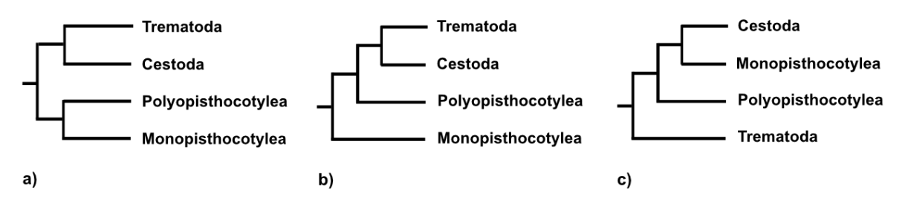

```{r global_options, include=FALSE}
# this tells r to fix images on positions were I want them and don't let LaTeX shuffle them around like crazy
knitr::opts_chunk$set(fig.pos = "H", out.extra = "", fig.align="center")
library("tidyverse")
```

# Introduction

Neodermata are obligat parasitic plathelminthes, subsuming three groups of flatworms including the Trematoda (flukes), Cestoda (tapeworms) and the Monogenea [@gibson2014; @littlewood1999; @Park2007]. Most Trematodes and Cestodes are endoparasitic with a complex life cycle, while Monogeneans are mainly adjusted to a ectoparasitic lifestyle with a direct life cycle [@gibson2014]. The Monogeneans, which mostly parasitise aquatic vertebrates, can be further subdivided into the Polyopisthocotyleans, that possess more complex haptors, with clamps and minuscule hooks, and are comprised mostly of blood-feeders that attach to the gills of their hosts. The second subsclass are the Monopisthocotyleans, which possess more simple haptors, only hooks, and can be found on skin or gills and feed on skin and or muscus [@gibson2014].

The evolutionary history of these three groups, as well as the origin of their differing life cycles (complex vs. simple) and the origin of the differing parasitic lifestyles (endo-/ectoparasitism) have been and are extensively debated. To gain more insight into the evolutionary history of the neodermata the phylogenetic position of the Monogeneans has to be resolved [@Park2007].  At the moment there are multiple competing hypotheses about the correct evolutionary history of the neodermata [@lockyer2003; @perkins2010; @littlewood1999; @olson2001; @laumer2014]. 

A special species in our group was the monogenean *Dictyocotyle coeliaca* (Nybelin, 1941), which belongs to the subsclass of Monopisthocotyleans. The taxa is quite rare and morphologically specialized [@dawes1948; @dawes1958]. It can be found in the cœlom of its hosts where it was found multiple times on liver tissue [@dawes1948]. Possible hosts include a variety of deep sea rays, like *Raja radiata* and *Raja lintea* [@dawes1948]. *Dictyocotyle coeliaca* belongs to the subclass of Monopisthocotyleans.

Our goal is with the addition of newly produced sequencing data of two species of monogeneans (*D. coeliaca* and *Leptocotyle minor*), the aim of this study is to further improve already existing sequencing data and, with the addition of openly accessible data from NCBI Genbank and a Multigene Matrix shed more light onto the controversely discussed phylogeny of the neodermata with a focus on the positioning of the monogenenans.

# Material and Methods

## DNA extraction and library prep

The samples of *Dictyocotyle coeliaca* were sampled in Norway from the host species *Raja radiata*. The Zymo Research DNA Miniprep Plus KIT was used to extract DNA.
After the extraction the concentration and length distribution were assessed with a Qubit 4 Flourometer using the broad range assay resulting in an concentration of 69.6 ng/µl and the TapeStation 2200 (Agilent Technologies) using genomic DNA screen tapes to assess the latter (Tape Station Report included?). To reach the recommended concentration of 1µg of high molecular weight DNA two sample specimen (20µl B164-65, 21µl B161-63) were pooled for the library prep. Library prep was done using the Nanopore Ligation Sequencing Kit (SQK-LSK109). To enrich sequences with a length of 3kb or longer, we used the long frame buffer following the protocol (Lab Protocol Version `GDE_9063_v109_revT_14Aug2019` which can be found on a github repositroy: [AMEB 2020 practical](https://github.com/chrishah/AMEB_2020_practical)).
The concentration of the prepped library was assessed using a Qubit 4 Flourometer. Quality assesment in library preparation followed the lab manual. The first Qubit measurement for *Dictyocotyle coeliaca* did result in 12.4ng/µl (total 744ng) and the second in 47.2ng/µl (total 660.8ng). For sequencing we used the minION platform of the Oxford Nanopore Technologies (ONT). The loading concentration of DNA in our samples was 566.4ng. Additionally DNA sequencing was also conducted for a second monogenen species, *Leptocotyle minor*.

## Public Gene Data

Phylogenetic tree analysis was done with public available data from [NCBI Genbank](https://www.ncbi.nlm.nih.gov) and assemblies from the University of Graz. Please refer to \@ref(tab:samples).


```{r samples, echo=FALSE}
t <- read.delim("data/public.tsv")
t$species <- paste("*", t$species, "*", sep="")
t$description <- str_replace_all(t$description, "https://www.ncbi.nlm.nih.gov/", "")
t$description <- str_replace_all(t$description, "-", "local sample")

n <- c("Taxa", "Group", "Source (https://www.ncbi.nlm.nih.gov/*)")
knitr::kable(
  t[,1:3], booktabs = TRUE,
  caption = 'List of taxa for phylogenetic tree building',
  col.names = n, format = "markdown"
)

```

## Genome Assembly

All of the used software was stored in docker containers. The genome assembly and tree building was done on a computer cluster, steps are reproducible because we facilitated docker^[https://www.docker.com/] container with singularity [@kurtzer2017].

In addition to the minION reads we also used local available Illumina reads of high quality. Illumina reads were quality corrected with TRIMMOMATIC^[docker://chrishah/trimmomatic-docker:0.38], for settings see code definition \@ref(def:code) [@bolger2014].

```{definition, label="code", name="Trimmomatic"}
Settings for Trimmomatic used for quality control of Illumina data.

~~~bash
trimmomatic PE -phred33
<input-output files>
ILLUMINACLIP:/usr/src/Trimmomatic/0.38/Trimmomatic-0.38/adapters/TruSeq3-PE-2.fa:2:30:10 \
LEADING:30 TRAILING:30 SLIDINGWINDOW:5:20 MINLEN:500
~~~
  
```

Assembly of contigs and scaffolds was done with PLATANUS^[docker://chrishah/platanus:v1.2.4], standard settings. Long reads from our ONT lab work were used in combination with the resulting scaffolds with pyScaf^[docker://chrishah/pyscaf-docker] logic to improve the quality of the assembly.

On all samples including our sequenced samples a BUSCO^[docker://chrishah/busco-docker:v3.1.0] analysis was done for gene labeling and quality control. The Metazoa `metazoa_odb9` lineage dataset was used with mode `genome` and flag for self-training August optimization mode (`--long`), because our given non-model species and `schistosoma` was used in the species select flag.

The phylogenetic tree building was archived with a `snakemake` workflow [@koster2012]. The workflow was generated by Christoph Hahn from the University of Graz and can be accced via GitHub Repository^[https://github.com/chrishah/AMEB_HPC_Snakemake]. It uses a custom script to extract ortholog and paralog genes from BUSCO, seuqnece aligning with clustalW, post alignment rating and masking with ALISCORE and ALICUT and raxml for protein gene model finding of each gene and single tree building, post-filtering with ncbi-BLAST and FASconCAT to generate a multigene alignment tree, which can be used to create a supermatrix and tree using all genes with raxml.

Full list of software and usage can be found in table \@ref(tab:software)

```{r software, echo=FALSE}
t <- read.csv("data/software.csv")
n <- c("Name", "Version", "Docker", "Application")
t <- t[order(t$program),]
knitr::kable(
  t[,c(1:3)], booktabs = TRUE, row.names = FALSE,
  caption = 'Full list of software and version. Docker representate the link to the docker ID, if local is given no docker container was used and the software was installed locally on the cluster server. Application is the short version of usage for the software.',
  col.names = n[1:3]
)

```

## Visualization

Graphical representation of the results was done with R [@r2020] and the packages [@tidyverse2019; @treeio2020; @ggtree2020; @ape2019]. The script with result data and text for this homework paper can be found on github^[https://github.com/HannesOberreiter/AMEB2020_dictyocotyle_coeliaca].

# Results

The quality analysis with BUSCO did show lower completness for the assembly of *Dictyocotyle coeliaca* which was improved with ONP reads. The cause for the low quality could not be identified but was probably in library prepreration as the DNA assessment after extraction did look good. Therefore, we used only the already given Illumina Sequences in further analysis.

The BUSCO analysis for the assembly of *Leptocotyle minor*, which only included the minION data, did result in 87 BUSCO genes.  

In total 313 BUSCO genes were used in the supermatrix to build the phylogenetic tree, but only 4 genes were available throughout all taxa, see figure \@ref(fig:genetree) for single gene tree of these genes. The resulting phylogenetic tree for the supermatrix can be seen in figure \@ref(fig:tree). It shows high bootstrap coverage for all nodes expect one internal clade node, but did not influence the phylogenetic position of the groups in question. If building gene trees for each of the four genes found in all taxa, the Monogenean subfamilies are not monophyletic in any of those trees. 

The result for the parasitic groups indicates Monopisthocotylea (Monogenea) as the most basal clade and Cestoda as sister group to monophyletic close related Trematoda and Polypisthocotylea (Monogenea). Therefore, in our results the major parasitic group of Monogenea (Monopisthocotylea and Polypisthocotylea) can be seen as paraphyletic. 

```{r genetree, fig.cap="Singel gene phylogenetic trees for genes available for all given taxa.", echo=FALSE, fig.width = 2}
knitr::include_graphics("data/gene_tree.pdf")
```

```{r tree, fig.cap="Phylogenetic tree of the major parasitic groups, clades with blue background belong to parasitic group of Monogenea.", echo=FALSE}
knitr::include_graphics("data/tree.pdf")
```

# Discussion

The problems why our minION reads did not improve the quality of the Illumina reads can be explained with a fragmented reads in the minION process. Because of the low length of fragments we did stop the minION sequencen early to save ressources for other reads. These resulted in "short'isch" reads and low coverage of this reads and no advandage for the illumina sequences was gained by this.

Our tree does not correspond to the currently proposed hypotheses of the major parasitic groups, see figure \@ref(fig:trees).

```{r trees, fig.cap="Three competing hypotheses of the evolution of Neodermata previously found supported by molecular data. a) (Lockyer, Olson, and Littlewood 2003), b) (Perkins et al. 2010), and c) (Littlewood, Rohde, and Clough 1999; Littlewood and Olson 2001; Laumer and Giribet 2014).", echo=FALSE}

```

# References
